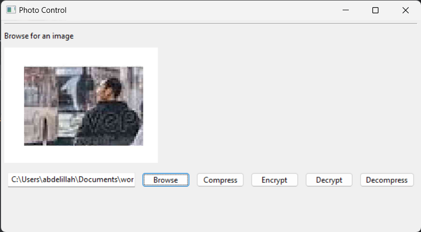

# Image Encryption And Compression App

This is a simple app that encrypts and compresses images. It uses the AES encryption algorithm and the zlib compression algorithm. The app is written in Python and uses the Tkinter library for the GUI.

## How to use

1. Clone the repository
2. Install the required libraries using `pip install -r requirements.txt`
3. Run the app using `python ImageCompressionEncryption.py`
4. Select an image file to encrypt and compress
5. Enter a password to encrypt the image
6. Click the "Encrypt and Compress" button
7. The encrypted and compressed image will be saved in the same directory as the original image
8. To decrypt and decompress the image, select the encrypted image file and enter the password used for encryption
9. Click the "Decrypt and Decompress" button
10. The decrypted and decompressed image will be saved in the same directory as the encrypted image
11. Enjoy your encrypted and compressed image!
12. If you have any questions or issues, feel free to open an issue in this repository
13. If you like the app, please give it a star!
14. Thank you for using the Image Encryption And Compression App!
15. Have a great day!
16. Goodbye!

## Screenshots


## License

This project is licensed under the MIT License - see the [LICENSE](LICENSE) file for details.
```

